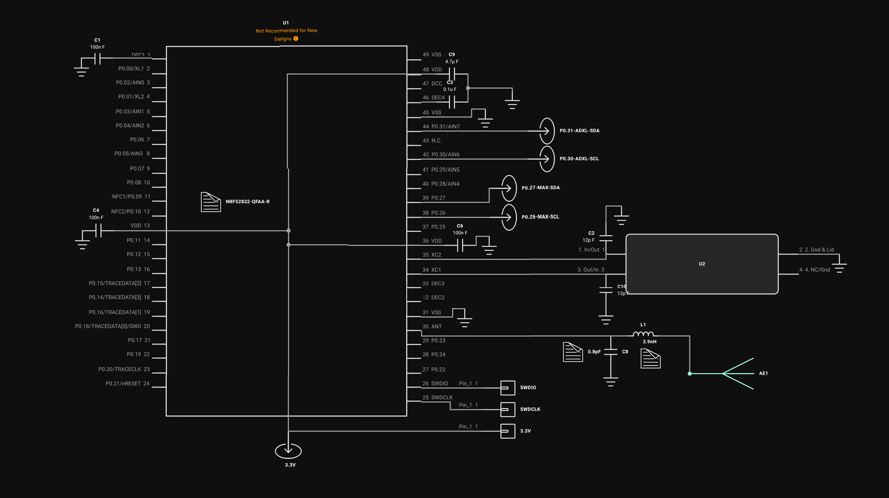
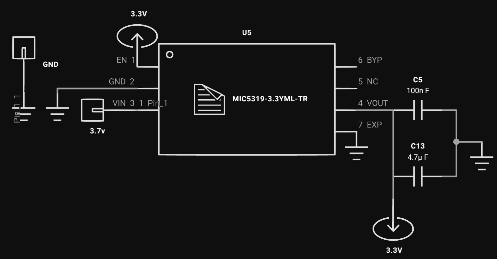
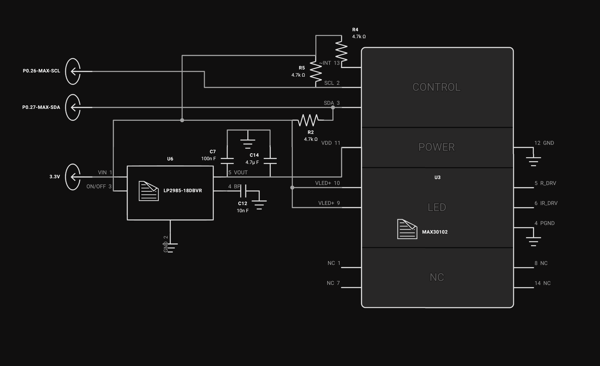
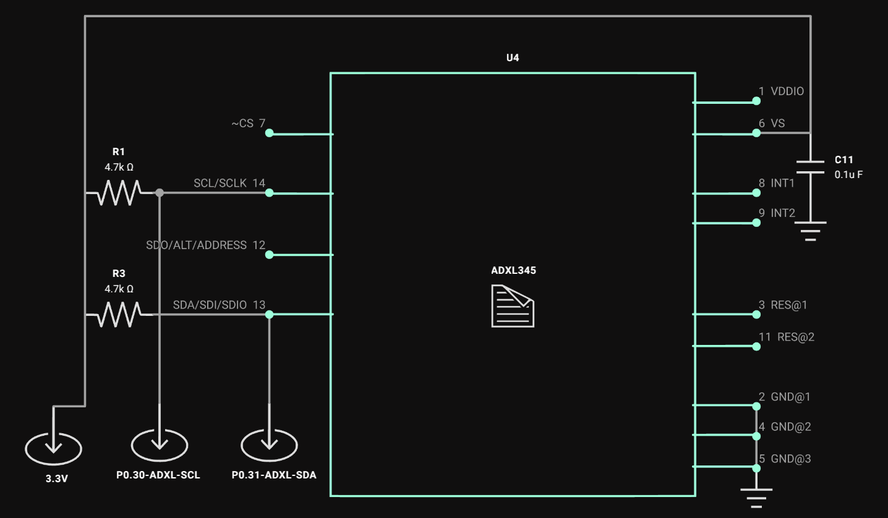

# Schematic and PCB Design Review

Welcome to the **Schematic and PCB Design Review** repository. This repository contains the latest schematic diagrams, PCB layouts, and essential files for the Our Bitwell project. Below you'll find detailed images of each schematic component, along with links to the Gerber and Bill of Materials (BOM) files.

---

## Table of Contents
- [Schematic Images](#schematic-images)
  - [nRF52832 with 32MHz Crystal and On-chip Antenna](#nrf52832-with-32mhz-crystal-and-on-chip-antenna)
  - [3.3V Regulator](#33v-regulator)
  - [MAX30102 (Heart Rate Sensor)](#max30102-heart-rate-sensor)
  - [ADXL345 (3-Axis Accelerometer)](#adxl345-3-axis-accelerometer)
- [Gerber Files](#gerber-files)
- [Bill of Materials (BOM)](#bill-of-materials-bom)

---

## Schematic Images

### nRF52832 with 32MHz Crystal and On-chip Antenna
- **Crystal:** ECS-320-CDX-2374  
- **Antenna:** 2450AT42A0100001E

---

### 3.3V Regulator
- **Powered by:** 3.7V Li-ion Battery

---

### MAX30102 (Heart Rate Sensor)
- **Includes:** 1.8V Regulator

---

### ADXL345 (3-Axis Accelerometer)

---

## Gerber Files

Download the Gerber files for PCB manufacturing and review:

[webdevsumit-bitwellband-v5p2-Gerbers-Version007f25a5.zip](webdevsumit-bitwellband-v5p2-Gerbers-Version007f25a5.zip)

---

## Bill of Materials (BOM)

Optional BOM files for detailed component information:

[webdevsumit-bitwellband-v5p2-BOM-V2024-12-18T145751133Z.zip](webdevsumit-bitwellband-v5p2-BOM-V2024-12-18T145751133Z.zip)

---

**Happy Reviewing!**

